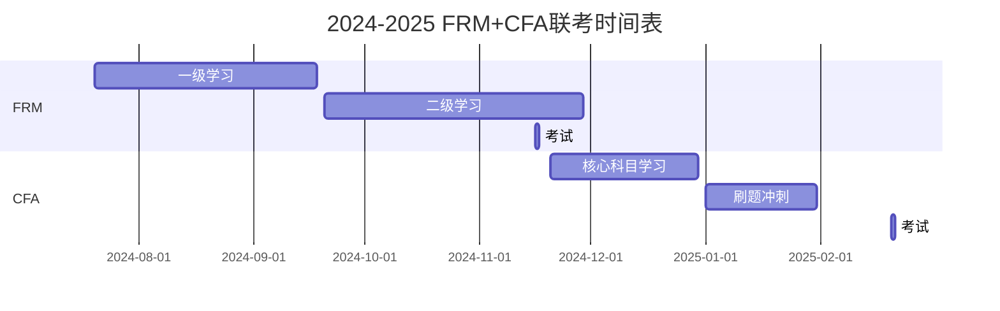

CDA：每月最后一周

以下是 **FRM（金融风险管理师）** 和 **CFA一级（特许金融分析师）** 的 **完整报考流程、考试时间及备考规划**，结合你的背景（金融数学/时间紧迫）优化后的方案：

---

### **一、FRM（金融风险管理师）完整流程**
#### **1. 考试级别与内容**
- **FRM Part I（一级）**：  
  - **重点**：定量分析（概率统计、蒙特卡洛模拟）、风险管理基础、估值与风险模型。  
  - **题量**：100道选择题，4小时。  
- **FRM Part II（二级）**：  
  - **重点**：市场风险、信用风险、操作风险、投资风险管理。  
  - **题量**：80道选择题，4小时。  
- **持证要求**：通过两级考试 + 2年相关工作经验（可考后5年内补齐）。

#### **2. 2024-2025年考试时间**
| 考试窗口 | 报名截止（常规阶段） | 考试日期 | 成绩公布 |  
|----------|----------------------|----------|----------|  
| **2024年11月** | 2024年9月30日 | 2024年11月16日 | 2025年1月4日 |  
| **2025年5月** | 2025年3月31日 | 2025年5月10日 | 2025年6月26日 |  

#### **3. 报考流程**
1. **注册GARP账号**：[官网链接](https://www.garp.org)  
2. **选择考试窗口**（建议联考两级节省时间）。  
3. **缴费**：  
   - 一级：$600（早鸟）→$800（常规）  
   - 二级：$600（早鸟）→$800（常规）  
4. **预约考位**：通过Pearson VUE选择考点（国内一线城市均有）。  

#### **4. 备考规划（6个月速通两级）**
- **阶段1（2个月）FRM一级**：  
  - **工具**：Schweser Notes + GARP官方题库。  
  - **重点**：定量分析（占30%分值，用数学优势碾压）。  
- **阶段2（3个月）FRM二级**：  
  - **工具**：《FRM Part II Practice Exams》+ 商业银行风控案例（利用家人资源）。  
- **阶段3（1个月）冲刺**：  
  - 模考（每周末限时4小时），错题针对性复盘。  

---

### **二、CFA一级（特许金融分析师）完整流程**
#### **1. 考试内容**
- **重点科目**：  
  - 量化方法（12%）、经济学（8%）、财务报表分析（13%）、公司金融（8%）、股权投资（10%）、固定收益（10%）。  
- **题量**：180道选择题，分两场（2小时15分钟/场）。  

#### **2. 2024-2025年考试时间**
| 考试窗口         | 早鸟报名截止     | 标准报名截止      | 考试日期           | 成绩公布    |     |
| ------------ | ---------- | ----------- | -------------- | ------- | --- |
| **2024年11月** | 2024年4月16日 | 2024年8月7日   | 2024年11月13-19日 | 2025年1月 |     |
| **2025年2月**  | 2024年5月14日 | 2024年10月29日 | 2025年2月19-25日  | 2025年4月 |     |
| **2025年5月**  | 2024年8月13日 | 2025年2月12日  | 2025年5月21-27日  | 2025年7月 |     |

#### **3. 报考流程**
1. **注册CFA账号**：[官网链接](https://www.cfainstitute.org)  
2. **选择考窗**（建议2025年2月，避开FRM）。  
3. **缴费**：  
   - $940（早鸟）→$1,250（标准）→$1,450（最后阶段）。  
4. **预约考位**：通过Prometric选择考点（需尽早抢考位）。  

#### **4. 备考规划（3个月高效版）**
- **阶段1（1个月）核心突破**：  
  - **只学**：量化方法、经济学、固定收益（用数学能力速通）。  
  - **跳过**：伦理道德、衍生品（考前2周突击即可）。  
- **阶段2（1.5个月）刷题**：  
  - CFA官网题库（优先计算题）、UWorld模拟卷。  
- **阶段3（0.5个月）冲刺**：  
  - 重点背公式（如久期计算、CAPM），做3套模考。  

---

### **三、你的双证联考方案（2024-2025）**
#### **方案1：极限操作（适合执行力强者）**

- **风险**：FRM两级与CFA一级间隔仅3个月，需每日投入5小时+。  

#### **方案2：稳妥版（推荐）**
- **2024年11月**：FRM两级联考。  
- **2025年2月**：CFA一级。  
- **优势**：避免重叠，FRM成绩公布后再调整CFA备考策略。  

---

### **四、关键注意事项**
1. **FRM考位紧张**：尽早报名（尤其上海/北京考点）。  
2. **CFA报名费阶梯上涨**：建议早鸟阶段（如2024年8月前报2025年2月考）。  
3. **数学能力最大化**：  
   - FRM定量分析、CFA量化方法可免学基础，直接刷高阶题。  

如果需要具体每日学习计划表（精确到小时），可以告诉我你的可用时间段（如每天19:00-23:00）！